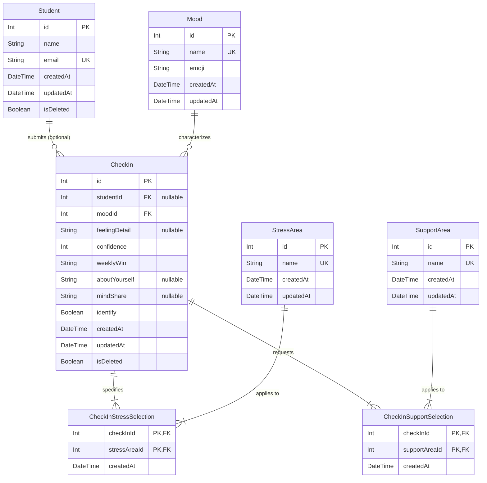

# Pathways Check-in Database Design Specification

This document details the normalized, scalable, and analytics-friendly PostgreSQL database design for **Pathways Check-in**, modeled using **Prisma ORM**.

---

## 1. Entity-Relationship (ER) Diagram

Below is the conceptual model representing the relations, lookups, and many-to-many junction tables that handle student submissions.



---

## 2. Complete Prisma Schema

Here is the complete production-ready `schema.prisma` configuration containing all indexes, cascades, constraints, and relational mappings.

```prisma
datasource db {
  provider = "postgresql"
  url      = env("DATABASE_URL")
}

generator client {
  provider = "prisma-client-js"
}

/// Lookup table storing the list of possible emotional/feeling states (e.g., Excited, Burnt Out)
model Mood {
  id        Int       @id @default(autoincrement())
  name      String    @unique @db.VarChar(50)
  emoji     String    @db.VarChar(10)
  createdAt DateTime  @default(now())
  updatedAt DateTime  @updatedAt
  checkIns  CheckIn[]

  @@map("moods")
}

/// Lookup table storing predefined stress areas (e.g., Personal Statement, Financial Aid)
model StressArea {
  id               Int                      @id @default(autoincrement())
  name             String                   @unique @db.VarChar(100)
  createdAt        DateTime                 @default(now())
  updatedAt        DateTime                 @updatedAt
  checkInSelections CheckInStressSelection[]

  @@map("stress_areas")
}

/// Lookup table storing requested support domains (e.g., Essay Review, Accountability)
model SupportArea {
  id               Int                      @id @default(autoincrement())
  name             String                   @unique @db.VarChar(100)
  createdAt        DateTime                 @default(now())
  updatedAt        DateTime                 @updatedAt
  checkInSelections CheckInSupportSelection[]

  @@map("support_areas")
}

/// Optional student profile record if a submission is non-anonymous
model Student {
  id        Int       @id @default(autoincrement())
  name      String    @db.VarChar(100)
  email     String    @unique @db.VarChar(150)
  createdAt DateTime  @default(now())
  updatedAt DateTime  @updatedAt
  isDeleted Boolean   @default(false)
  checkIns  CheckIn[]

  @@index([email])
  @@map("students")
}

/// Main entry representing a single, specific weekly check-in submission
model CheckIn {
  id            Int                      @id @default(autoincrement())
  studentId     Int?                     // Nullable to support completely anonymous submissions
  student       Student?                 @relation(fields: [studentId], references: [id], onDelete: SetNull)
  
  moodId        Int
  mood          Mood                     @relation(fields: [moodId], references: [id], onDelete: Restrict)
  
  feelingDetail String?                  @db.Text
  confidence    Int                      // Scale of 1-10
  weeklyWin     String                   @db.Text
  aboutYourself String?                  @db.Text
  mindShare     String?                  @db.Text
  identify      Boolean                  @default(false) // Flags anonymous vs named submission
  
  createdAt     DateTime                 @default(now())
  updatedAt     DateTime                 @updatedAt
  isDeleted     Boolean                  @default(false) // Soft delete support

  stressAreas   CheckInStressSelection[]
  supportNeeds  CheckInSupportSelection[]

  @@index([createdAt(sort: Desc)])
  @@index([moodId])
  @@index([confidence])
  @@index([identify])
  @@map("check_ins")
}

/// Many-to-Many Junction table connecting a Check-in to selected Stress Areas
model CheckInStressSelection {
  checkInId    Int
  checkIn      CheckIn    @relation(fields: [checkInId], references: [id], onDelete: Cascade)
  
  stressAreaId Int
  stressArea   StressArea @relation(fields: [stressAreaId], references: [id], onDelete: Restrict)
  
  createdAt    DateTime   @default(now())

  @@id([checkInId, stressAreaId])
  @@index([stressAreaId])
  @@map("check_in_stress_selections")
}

/// Many-to-Many Junction table connecting a Check-in to selected Support Needs
model CheckInSupportSelection {
  checkInId     Int
  checkIn       CheckIn     @relation(fields: [checkInId], references: [id], onDelete: Cascade)
  
  supportAreaId Int
  supportArea   SupportArea @relation(fields: [supportAreaId], references: [id], onDelete: Restrict)
  
  createdAt     DateTime    @default(now())

  @@id([checkInId, supportAreaId])
  @@index([supportAreaId])
  @@map("check_in_support_selections")
}
```

---

## 3. SQL & Prisma Seed Script

This seed script initializes the lookup values for Moods, Stress Areas, and Support Areas, and populates realistic dummy entries for a demo cohort of **10 distinct student check-ins** (half anonymous, half named) to facilitate immediate administrative testing.

```typescript
import { PrismaClient } from '@prisma/client';

const prisma = new PrismaClient();

async function main() {
  console.log('🌱 Starting database seeding...');

  // 1. Seed Mood Lookup Table
  const moodsData = [
    { name: 'Excited', emoji: '😁' },
    { name: 'Motivated', emoji: '🙂' },
    { name: 'Okay', emoji: '😐' },
    { name: 'Overwhelmed', emoji: '😕' },
    { name: 'Burnt Out', emoji: '😣' },
  ];

  const moods = [];
  for (const mood of moodsData) {
    const record = await prisma.mood.upsert({
      where: { name: mood.name },
      update: {},
      create: mood,
    });
    moods.push(record);
    console.log(`- Seeded mood: ${mood.name}`);
  }

  // 2. Seed Stress Areas Lookup Table
  const stressAreasData = [
    'Personal Statement',
    'Supplemental Essays',
    'Financial Aid',
    'Time Management',
    'Motivation',
    'Balancing Responsibilities',
    'SAT/ACT Preparation',
  ];

  const stressAreas = [];
  for (const name of stressAreasData) {
    const record = await prisma.stressArea.upsert({
      where: { name },
      update: {},
      create: { name },
    });
    stressAreas.push(record);
    console.log(`- Seeded stress area: ${name}`);
  }

  // 3. Seed Support Needs Lookup Table
  const supportNeedsData = [
    'Essay Review',
    'Brainstorming',
    'Motivation Check-in',
    'Financial Aid Guidance',
    'Accountability Partnering',
    'Application Planning',
  ];

  const supportAreas = [];
  for (const name of supportNeedsData) {
    const record = await prisma.supportArea.upsert({
      where: { name },
      update: {},
      create: { name },
    });
    supportAreas.push(record);
    console.log(`- Seeded support area: ${name}`);
  }

  // 4. Seed 5 Identified Students
  const studentsData = [
    { name: 'Kofi Owusu', email: 'kofi.owusu@example.com' },
    { name: 'Amina Diop', email: 'amina.diop@example.com' },
    { name: 'Chinedu Uche', email: 'chinedu.uche@example.com' },
    { name: 'Zola Mandela', email: 'zola.mandela@example.com' },
    { name: 'Tariq Said', email: 'tariq.said@example.com' },
  ];

  const students = [];
  for (const student of studentsData) {
    const record = await prisma.student.upsert({
      where: { email: student.email },
      update: {},
      create: student,
    });
    students.push(record);
    console.log(`- Seeded student: ${student.name}`);
  }

  // 5. Seed 10 Staggered Cohort Check-Ins (5 Identified, 5 Anonymous)
  const submissions = [
    {
      studentId: students[0].id, // Kofi
      identify: true,
      moodName: 'Excited',
      feelingDetail: 'Drafted my personal statement intro! Stoked about the story structure.',
      confidence: 9,
      weeklyWin: 'Finished my personal statement introduction and outline.',
      aboutYourself: 'I love playing chess and learning about robotics.',
      mindShare: 'Thanks to mentor Sarah for the initial brainstorm help.',
      stresses: ['Personal Statement', 'Motivation'],
      supports: ['Essay Review'],
      backdateDays: 9,
    },
    {
      studentId: students[1].id, // Amina
      identify: true,
      moodName: 'Motivated',
      feelingDetail: 'Ready to tackle my financial aid papers this weekend.',
      confidence: 8,
      weeklyWin: 'Gathered all required tax slips for scholarship forms.',
      aboutYourself: 'Hoping to major in Biomedical Engineering.',
      stresses: ['Financial Aid', 'Time Management'],
      supports: ['Financial Aid Guidance', 'Application Planning'],
      backdateDays: 8,
    },
    {
      studentId: null, // Anonymous 1
      identify: false,
      moodName: 'Okay',
      feelingDetail: 'Applications are moving slowly, but keeping my head up.',
      confidence: 6,
      weeklyWin: 'Booked an appointment with my English teacher for recommendations.',
      stresses: ['Supplemental Essays', 'Time Management'],
      supports: ['Motivation Check-in', 'Accountability Partnering'],
      backdateDays: 7,
    },
    {
      studentId: students[2].id, // Chinedu
      identify: true,
      moodName: 'Overwhelmed',
      feelingDetail: 'Too many supplementary questions to answer. Struggling to organize deadlines.',
      confidence: 4,
      weeklyWin: 'Drafted outline for two Stanford supplemental essays.',
      stresses: ['Supplemental Essays', 'Time Management', 'Balancing Responsibilities'],
      supports: ['Application Planning', 'Brainstorming'],
      backdateDays: 6,
    },
    {
      studentId: null, // Anonymous 2
      identify: false,
      moodName: 'Burnt Out',
      feelingDetail: 'High school midterms coinciding with application prep is too draining.',
      confidence: 2,
      weeklyWin: 'I still managed to write 250 words for my UC Application.',
      stresses: ['Time Management', 'Balancing Responsibilities', 'Motivation'],
      supports: ['Motivation Check-in', 'Accountability Partnering'],
      backdateDays: 5,
    },
    {
      studentId: students[3].id, // Zola
      identify: true,
      moodName: 'Excited',
      feelingDetail: 'Had a super helpful essay revision call with a senior advisor.',
      confidence: 10,
      weeklyWin: 'Polished the final draft of my Common App Essay!',
      aboutYourself: 'Avid marathon runner and reader.',
      stresses: ['Supplemental Essays'],
      supports: ['Essay Review'],
      backdateDays: 4,
    },
    {
      studentId: null, // Anonymous 3
      identify: false,
      moodName: 'Motivated',
      feelingDetail: 'Working hard on my math SAT prep material.',
      confidence: 7,
      weeklyWin: 'Improved my diagnostic test score by 80 points!',
      stresses: ['SAT/ACT Preparation', 'Motivation'],
      supports: ['Accountability Partnering'],
      backdateDays: 3,
    },
    {
      studentId: students[4].id, // Tariq
      identify: true,
      moodName: 'Okay',
      feelingDetail: 'Just taking things one day at a time.',
      confidence: 5,
      weeklyWin: 'Organized my portfolio submission folder.',
      stresses: ['Personal Statement', 'Balancing Responsibilities'],
      supports: ['Essay Review'],
      backdateDays: 2,
    },
    {
      studentId: null, // Anonymous 4
      identify: false,
      moodName: 'Overwhelmed',
      feelingDetail: 'Having issues getting school transcripts ready in time.',
      confidence: 3,
      weeklyWin: 'Resolved my fee waiver voucher code issue.',
      stresses: ['Financial Aid', 'Balancing Responsibilities'],
      supports: ['Financial Aid Guidance'],
      backdateDays: 1,
    },
    {
      studentId: null, // Anonymous 5
      identify: false,
      moodName: 'Motivated',
      feelingDetail: 'Super happy with the brainstorm results.',
      confidence: 8,
      weeklyWin: 'Found a unique angle to talk about my volunteer work in my essay.',
      stresses: ['Personal Statement'],
      supports: ['Brainstorming', 'Essay Review'],
      backdateDays: 0,
    },
  ];

  for (const sub of submissions) {
    const selectedMood = moods.find((m) => m.name === sub.moodName);
    if (!selectedMood) continue;

    const createdAtDate = new Date();
    createdAtDate.setDate(createdAtDate.getDate() - sub.backdateDays);

    const checkIn = await prisma.checkIn.create({
      data: {
        studentId: sub.studentId,
        moodId: selectedMood.id,
        feelingDetail: sub.feelingDetail,
        confidence: sub.confidence,
        weeklyWin: sub.weeklyWin,
        aboutYourself: sub.aboutYourself || null,
        mindShare: sub.mindShare || null,
        identify: sub.identify,
        createdAt: createdAtDate,
      },
    });

    // Seed selected Stress Areas
    for (const stressName of sub.stresses) {
      const sArea = stressAreas.find((s) => s.name === stressName);
      if (sArea) {
        await prisma.checkInStressSelection.create({
          data: {
            checkInId: checkIn.id,
            stressAreaId: sArea.id,
          },
        });
      }
    }

    // Seed selected Support Needs
    for (const supportName of sub.supports) {
      const supArea = supportAreas.find((s) => s.name === supportName);
      if (supArea) {
        await prisma.checkInSupportSelection.create({
          data: {
            checkInId: checkIn.id,
            supportAreaId: supArea.id,
          },
        });
      }
    }
  }

  console.log('✅ Seeding completed successfully!');
}

main()
  .catch((e) => {
    console.error('❌ Error during seeding: ', e);
    process.exit(1);
  })
  .finally(async () => {
    await prisma.$disconnect();
  });
```

---

## 4. Normalization & Architectural Decisions

To avoid duplicate entries, optimize storage, and simplify analytical rollups, we separated static options from highly volatile student check-in submissions.

### A. Third Normal Form (3NF) Separation
- **No Comma-Separated Values**: Common databases suffer from storing stress areas as arrays of strings or delimited fields (e.g., `"Financial Aid, Time Management"`). This makes searching or counting selections highly expensive (requiring wildcards like `LIKE '%Time Management%'`).
- **Lookups**: `Mood`, `StressArea`, and `SupportArea` represent static entities. Moving them into lookup tables protects integrity. Mentors can append a new stress area (e.g., *"College Interview Prep"*) directly via a single insert row inside `StressArea` without carrying out heavy migrations.
- **Junction Tables**: The relationship between a Check-in and stress areas is **Many-to-Many**. We introduced the `CheckInStressSelection` and `CheckInSupportSelection` junction tables to fully resolve this association.

### B. Index Optimization Strategy
Database performance is kept optimal using appropriate single and compound indexes:
1. `check_ins.createdAt(sort: Desc)`: Accelerates fetching the submissions feed which prioritizes listing entries from newest to oldest.
2. `students.email`: Unique constraint automatically indexes this column, speeding up lookup of non-anonymous recurring profiles.
3. `check_ins.moodId` and `check_ins.confidence`: Speeds up analytic charts that group distribution counts or average student self-ratings over periods.
4. `check_ins.identify`: Ensures rapid segregation of anonymous vs. identified student logs for compliance and reporting.

### C. Foreign Key Cascade & Soft Delete Architecture
- **SetNull on Student Delete**: If a student's administrative account profile is soft-deleted, we maintain their check-ins for aggregate analytics, setting `studentId = NULL` but preserving the anonymous record.
- **Cascade on Submission Delete**: If an administrator purges a check-in entirely, the cascade rules on `CheckInStressSelection` and `CheckInSupportSelection` ensure that their orphaned association entries are automatically cleared from disk.
- **Soft Delete Support**: The boolean column `isDeleted` on `Student` and `CheckIn` ensures safe data recovery and preserves database history.

---

## 5. Raw SQL Analytics Queries

These high-performance raw PostgreSQL queries are fully compatible with any business intelligence layer or custom reporting endpoint.

### Query A: Aggregate Mood Trends (Over a 30-day window)
```sql
SELECT 
    m.name AS mood_state,
    m.emoji,
    COUNT(c.id) AS count,
    ROUND((COUNT(c.id)::decimal / SUM(COUNT(c.id)) OVER ()) * 100, 1) as percentage
FROM check_ins c
JOIN moods m ON c.moodId = m.id
WHERE c.isDeleted = FALSE AND c.createdAt >= NOW() - INTERVAL '30 days'
GROUP BY m.id, m.name, m.emoji
ORDER BY count DESC;
```

### Query B: Ranking Top 5 Active Stress Areas (Cohort bottlenecks)
```sql
SELECT 
    sa.name AS stress_factor,
    COUNT(css.checkInId) AS student_count
FROM check_in_stress_selections css
JOIN stress_areas sa ON css.stressAreaId = sa.id
JOIN check_ins c ON css.checkInId = c.id
WHERE c.isDeleted = FALSE
GROUP BY sa.id, sa.name
ORDER BY student_count DESC
LIMIT 5;
```

### Query C: Average Confidence Level of Cohort Staggered by Week
```sql
SELECT 
    DATE_TRUNC('week', createdAt) AS checkin_week,
    ROUND(AVG(confidence)::numeric, 2) AS average_confidence,
    COUNT(id) AS total_submissions
FROM check_ins
WHERE isDeleted = FALSE
GROUP BY checkin_week
ORDER BY checkin_week DESC;
```

---

## 6. Future Scalability Expansion Pathways

This database design is engineered to support next-stage user requirements with zero structural rewrites:

1. **Multiple Cohorts / Multiple Programs**:
   - Create a `Cohort` table (fields: `id`, `name`, `startDate`, `endDate`).
   - Create a `Program` table mapping to multiple cohorts.
   - Reference `cohortId` in the `Student` or `CheckIn` table to facilitate cohort-isolated analytics and dashboards.
2. **Mentors & Student Authentication**:
   - Create a generic `User` table (fields: `id`, `email`, `passwordHash`, `role`).
   - Associate the `Student` table to the `User` table via a 1:1 foreign key.
   - Introduce a `Mentor` table mapping to specific cohorts to control which students a mentor has security permissions to review.
3. **Weekly Outreach Queues**:
   - Query students whose confidence levels are lower than 5 and who requested "Accountability Partnering" or "Essay review" to dynamically build a high-priority mentor call queue.
